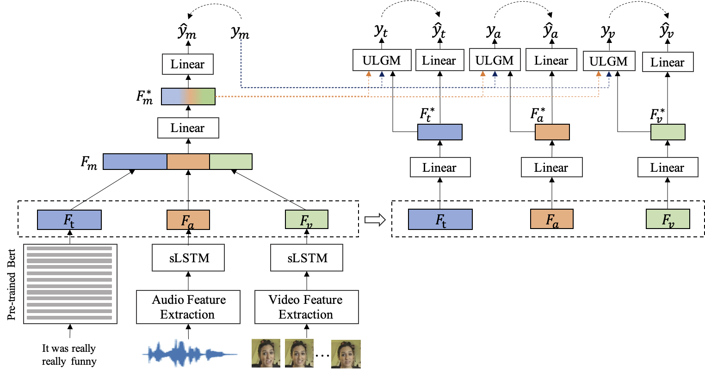

## SELF-MM
> Pytorch implementation for codes in [Learning Modality-Specific Representations with Self-Supervised Multi-Task Learning for Multimodal Sentiment Analysis (AAAI2021)](https://arxiv.org/abs/2102.04830). Please see our another repo [MMSA](https://github.com/thuiar/MMSA) for more details, which is a scalable framework for MSA.

### Model



### Usage

1. Datasets and pre-trained berts

Download dataset features and pre-trained berts from the following links.

- [Baidu Cloud Drive](https://pan.baidu.com/s/1oksuDEkkd3vGg2oBMBxiVw) with code: `ctgs`
- [Google Cloud Drive](https://drive.google.com/drive/folders/1E5kojBirtd5VbfHsFp6FYWkQunk73Nsv?usp=sharing)

For all features, you can use `SHA-1 Hash Value` to check the consistency.
> `MOSI/unaligned_50.pkl`: `5da0b8440fc5a7c3a457859af27458beb993e088`  
> `MOSI/aligned_50.pkl`: `5c62b896619a334a7104c8bef05d82b05272c71c`  
> `MOSEI/unaligned_50.pkl`: `db3e2cff4d706a88ee156981c2100975513d4610`  
> `MOSEI/aligned_50.pkl`: `ef49589349bc1c2bc252ccc0d4657a755c92a056`  
> `SIMS/unaligned_39.pkl`: `a00c73e92f66896403c09dbad63e242d5af756f8`  

Due to the size limitations, the MOSEI features and SIMS raw videos are available in `Baidu Cloud Drive` only. All dataset features are organized as:

```python
{
    "train": {
        "raw_text": [],
        "audio": [],
        "vision": [],
        "id": [], # [video_id$_$clip_id, ..., ...]
        "text": [],
        "text_bert": [],
        "audio_lengths": [],
        "vision_lengths": [],
        "annotations": [],
        "classification_labels": [], # Negative(< 0), Neutral(0), Positive(> 0)
        "regression_labels": []
    },
    "valid": {***}, # same as the "train" 
    "test": {***}, # same as the "train"
}
```

For MOSI and MOSEI, the pre-extracted text features are from BERT, different from the original glove features in the [CMU-Multimodal-SDK](http://immortal.multicomp.cs.cmu.edu/raw_datasets/processed_data/).

For SIMS, if you want to extract features from raw videos, you need to install [Openface Toolkits](https://github.com/TadasBaltrusaitis/OpenFace/wiki) first, and then refer our codes in the `data/DataPre.py`.

```
python data/DataPre.py --data_dir [path_to_Dataset] --language ** --openface2Path  [path_to_FeatureExtraction]
```

For bert models, you also can download [Bert-Base, Chinese](https://storage.googleapis.com/bert_models/2018_11_03/chinese_L-12_H-768_A-12.zip) from [Google-Bert](https://github.com/google-research/bert). And then, convert tensorflow into pytorch using [transformers-cli](https://huggingface.co/transformers/converting_tensorflow_models.html)  

2. Clone this repo and install requirements.
```
git clone https://github.com/thuiar/Self-MM
cd Self-MM
conda create --name self_mm python=3.7
source activate self_mm
pip install -r requirements.txt
```

3. Make some changes
Modify the `config/config_tune.py` and `config/config_regression.py` to update dataset pathes.

4. Run codes
```
python run.py --modelName self_mm --datasetName mosi
```

### Results

> Detailed results are shown in [MMSA](https://github.com/thuiar/MMSA) > [results/result-stat.md](https://github.com/thuiar/MMSA/blob/master/results/result-stat.md). 

### Paper
---
Please cite our paper if you find our work useful for your research:
```
@inproceedings{yu2021le,
  title={Learning Modality-Specific Representations with Self-Supervised Multi-Task Learning for Multimodal Sentiment Analysis},
  author={Yu, Wenmeng and Xu, Hua and Ziqi, Yuan and Jiele, Wu},
  booktitle={Proceedings of the AAAI Conference on Artificial Intelligence},
  year={2021}
}
```
